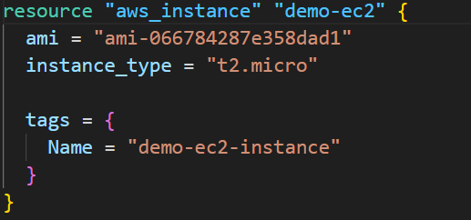
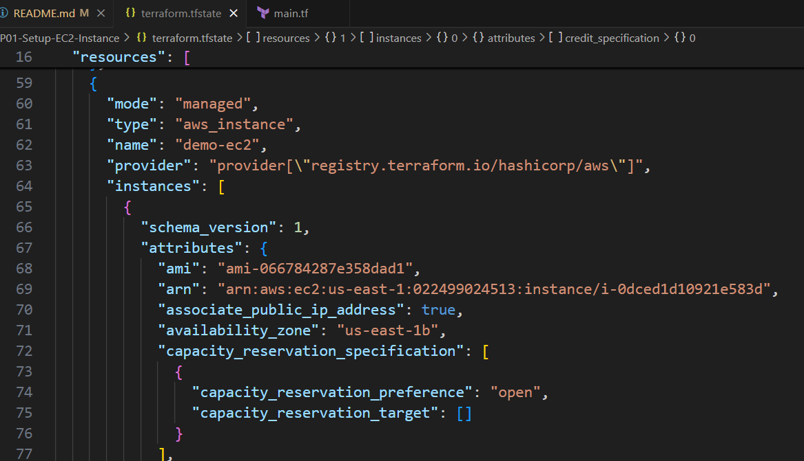

# Learn and Build using Terraform
## Learning notes

### Authentication and Authorization
- Authentication is the process of verifying who a user is.
- Authorization is the process of verifying what access they have.

#### Different ways you can use credentials for AWS Provider
```terraform
$ cat ~/.aws/config
[default]
region = us-east-1
[profile cloud-adm]
region = us-east-1

provider "aws" {
  region = "us-east-1"
}

provider "aws" {
    region      = "us-east-1"
    access_key  = "***********************"
    secret_key  = "***********************"
}

provider "aws" {
  profile = "cloud-adm"
}
```
### Basic Concepts to Remember
- Providers:
    - A provider is a plugin that lets terraform manage an external APIs.
    - When we run terraform init, plugins required for the provider are automatically downloaded and saved locally to a .terraform directory.

- Resource:
    - Resource block describes one or more infrastructure objects associated with the provider.
    - Ex: 
        ○ resource aws_instance
        ○ resource aws_alb
        ○ resource iam_user
    - A resource block declares a resource of a given type ("aws_instance") with a given local name ("demo-ec2")
    - Resource type and name together serve as a Identifier for a given resource and so must be unique.
- Provider tiers:
    - Official
    - Partner
    - Community

### Terraform Commands
- terraform init: Go ahead and download appropriate plugin associated with the provider.
- terraform plan: It will show you what it will create/destroy based on the code written in terraform file. It - will not create any resource … to create a resource you need to perform terraform apply.
- terraform apply: 
- terraform refresh: it will check the latest state of the infrastructure and update the state file accordingly.
You shouldn't typically need to use this command, because terraform automatically performs the same refreshing actions as part of creating a plan in both the terraform plan and terraform apply commands.
- terraform destroy: 
    - terraform destroy: allows us to destroy all the resources that are created within the folder.
    - terraform destroy -target aws_instance.demo-ec2: allows to destroy only specific resource. 

### Understanding of terraform state files
- Terraform State file: Terraform stores the state of the infrastructure that is being created from the TF files.
- This state allows terraform to map real world resources to your existing configurations.
- State file contains the information associated with the resources that are currently live.

- Desired State: Terraform's primary function is to create, modify and destroy infrastructure resources to match the desired state described in a Terraform configuration.


Current State: Current state is the actual state of a resource that is currently deployed.

Important Note:
    Terraform tries to ensure that the deployed infrastructure is based on the desired state
If there is a difference between the two, terraform plan presents a description of the changes necessary to achieve the desired state.
## Hands On Labs
## POC Solutions/Projects
## Interview QA
1. What will happend if you delete the terraform state file and perform the terraform apply. 
A : It will assume resources were not created as per terraform configuration and will create the resources again.
    It can through the error during the apply: api error InvalidGroup.Duplicate: The security group 'terraform-firewall' already exists for VPC 'vpc-07bc4f6597e7bd046' 

    Because you can't create a security group with the same name.


# Follow the Steps to Provision the AWS Infrastructure for the Atlassian Suite

## Create an S3 Bucket in u region to store the terraform state files and Artifacts.
```shell
aws s3api create-bucket --bucket learn2024-terraform-tfstates --region=us-east-1

```

## Create an Dynamo DB table for State Locking
```shell
aws dynamodb create-table --table-name learn2024-dynamodb-tbl --attribute-definitions AttributeName=LockID,AttributeType=S --key-schema AttributeName=LockID,KeyType=HASH --provisioned-throughput ReadCapacityUnits=5,WriteCapacityUnits=5 --region us-east-1
```

## Execute Below Terraform commands to init, plan and apply 
```shell
terraform -chdir=./environments/dev init
terraform -chdir=./environments/dev plan
terraform -chdir=./environments/dev apply
```
